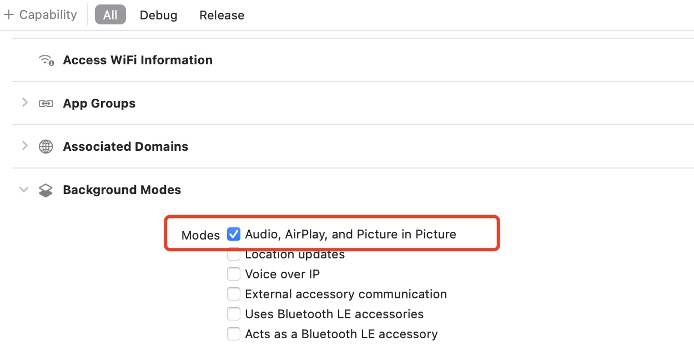

## iOS画中画总结
之前在做iOS的音视频播放的时候，iOS小窗播放音视频退到后台后启用画中画功能，遇到一些坑，记录一下，做一些总结

通过分析B站等一些视频播放APP发现，B站播放视频开启小窗后，播放在APP内变成小窗播放，该小窗是开发者自定义的view，退到后台后，开启了画中画(交由系统接管)，并实现无缝的进度衔接，从画中画回到APP，画中画消失，切换回自定义的播放View, 并同步回系统画中画的进度

### 启用画中画
在Xcode的能力中勾选开启画中画


### 实现画中画
iOS系统提供了```AVPictureInPictureController```API给开发者，可以实现画中画

-  创建画中画属性，实现```<AVPictureInPictureControllerDelegate>```代理
 ```
@property (nonatomic, strong) AVPictureInPictureController *pipVC;
@property (nonatomic, strong) AVPlayerLayer *playerLayer;
@property (nonatomic, strong) AVPlayer *player;
```
- 判断是否支持画中画功能并开启权限
``` 
if (!_player) {
    self.player = [AVPlayer playerWithURL:[NSURL URLWithString: self.playerShowView.currentPlayUrl]];
    self.playerLayer = [AVPlayerLayer playerLayerWithPlayer:self.player];
}

if ([AVPictureInPictureController isPictureInPictureSupported]) {
    @try {
        NSError *error = nil;
        [[AVAudioSession sharedInstance] setCategory:AVAudioSessionCategoryPlayback error:&error];
        [[AVAudioSession sharedInstance] setActive:YES error:&error];
        
        if (error) {
            NSLog(@"请求后台播放权限失败: %@",error);
        }
        
    } @catch (NSException *exception) {
        NSLog(@"AVAudioSession发生错误");
    }
    self.pipVC = [[AVPictureInPictureController alloc] initWithPlayerLayer:self.playerLayer];
    self.pipVC.delegate = self;
}
```

- 实现画中画代理
```
// 关闭画中画且恢复播放界面
- (void)pictureInPictureController:(AVPictureInPictureController *)pictureInPictureController restoreUserInterfaceForPictureInPictureStopWithCompletionHandler:(void (^)(BOOL restored))completionHandler {
    
    completionHandler(true);
    
    CGFloat currentTime = self.player.currentTime.value / self.player.currentTime.timescale;
    NSLog(@"画中画恢复了: %f", currentTime);
}
```

### 画中画遇到的一些坑
- 不能把```playerLayer```加在window的layer上会报错，加在view的layer上不会报错
- 画中画的宽度或者尺寸设置为屏幕的尺寸后，APP退到后台，会自动开启画中画
- 开启画中画的时候需要判断状态，刚初始化的AVPictureInPictureController直接开启是不可用的


